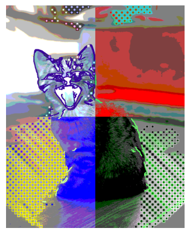
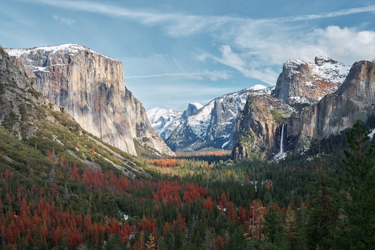

# Visión por Computador | Práctica 1

  

Esta práctica ha servido para comprender la representación de imágenes de grises y color, su modificación, visualización y tratamiento básico. La ejecución del cuaderno no requiere librerías adicionales.

## Fuentes

Las siguientes fuentes han sido utilizadas durante el desarrollo de la práctica para obtener información sobre el uso de funciones y técnicas de procesamiento de imágenes:

* **Documentación de OpenCV 2.4.13.7**: https://docs.opencv.org/2.4.13.7/genindex.html
* `cv2.cvtColor`: https://docs.opencv.org/2.4.13.7/modules/imgproc/doc/miscellaneous_transformations.html#cv2.cvtColor
* `cv2.GaussianBlur`: https://docs.opencv.org/2.4.13.7/modules/imgproc/doc/filtering.html#cv2.GaussianBlur
* `cv2.Canny`: https://docs.opencv.org/2.4.13.7/modules/imgproc/doc/feature_detection.html#cv.Canny
* `cv2.dilate`: https://docs.opencv.org/2.4.13.7/modules/imgproc/doc/filtering.html#cv2.dilate

## Imágenes utilizadas

Para realizar la práctica se han usado 2 imágenes obtenidas de **Unsplash**, que tiene una licencia que permite su uso y modificación.

Licencia: [Licencia de Unsplash](https://unsplash.com/es/licencia)

Las imágenes utilizadas en esta práctica son de los siguientes autores:

* [Aniket Deole](https://unsplash.com/es/fotos/montana-rodeada-de-arboles-bajo-el-cielo-nublado-T-tOgjWZ0fQ)

  

* [Loan](https://unsplash.com/es/fotos/gatito-atigrado-plateado-en-el-suelo-7AIDE8PrvA0)

  

